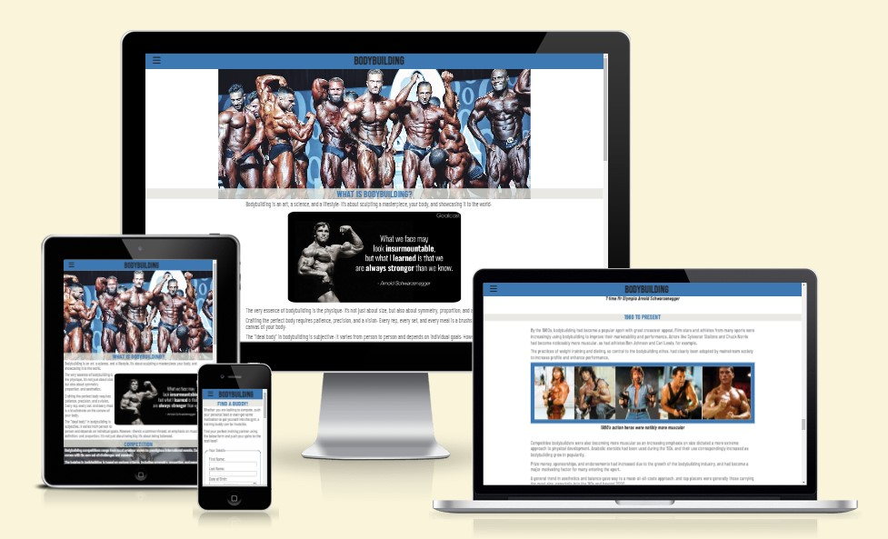
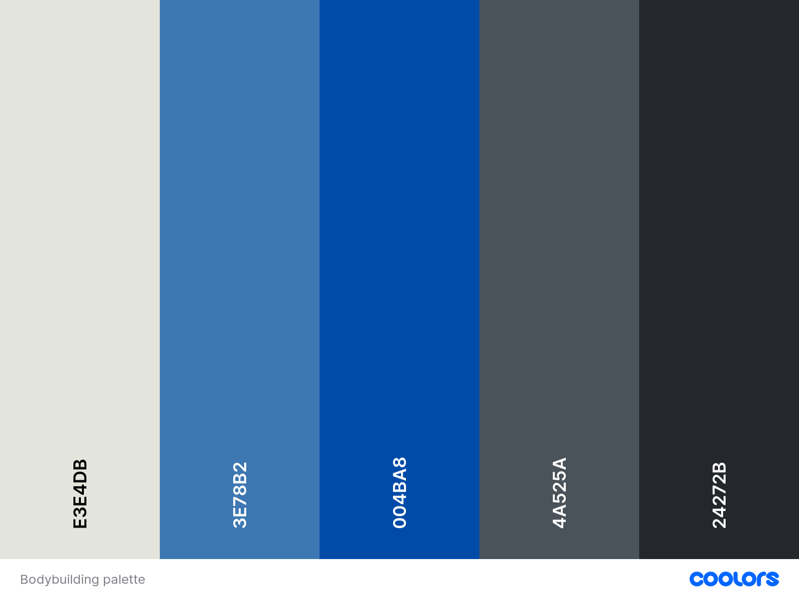
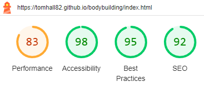
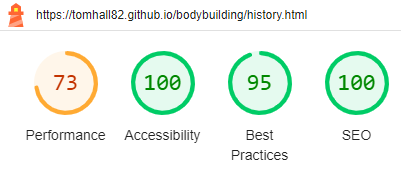
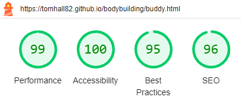

# Bodybuilding

This website is to offer an insite to what bodybuilding is and to help beginners and seasoned trainers find their next training buddy.

[Visit Bodybuilding](https://tomhall82.github.io/bodybuilding/)

## Contents

- [User Experience](#user-experience-ux)

  - [Client Goals](#client-goals)
  - [First Time Visitor Goals](#first-time-visitor-goals)
  - [Returning Visitor Goals](#returning-visitor-goals)

- [Design](#design)

  - [Colour Scheme](#colour-scheme)
  - [Typography](#typography)
  - [Imagery](#imagery)

- [Features](#features)

  - [All pages](#all-pages-have)
  - [Home page](#home-page)
  - [The History of Bodybuilding page](#the-history-of-bodybuilding-page)
  - [Find a Buddy! page](#find-a-buddy-page)
  - [Future Implementations](#future-implementations)

- [Accessibility](#accessibility)
- [Technologies Used](#technologies-used)

  - [Languages Used](#languages-used)
  - [Libraries & Programs Used](#libraries--programs-used)

- [Deployment & Local Development](#deployment--local-development)

  - [Deployment](#deployment)
  - [How to Fork](#how-to-fork)
  - [How to Clone](#how-to-clone)

- [Testing](#testing)

  - [W3C Validator](#w3c-validator)
  - [Lighthouse](#lighthouse)
  - [Solved Bugs](#solved-bugs)
  - [Known Bugs](#known-bugs)

- [Credits]

  - [Code Used](#code-used)
  - [Content](#content)
  - [Media](#media)
    - [Home](#home)
    - [History of Bodybuilding](#the-history-of-bodybuilding)
    - [Find a Buddy!](#find-a-buddy)

- [Acknowledgments](#acknowledgments)

## User Experience (UX)

### Client Goals

- To be able to view the site on a range of device sizes.
- To explain what bodybuilding is and the benefits.
- To run through the essentials of bodybuilding history chronologically.
- To introduce the user to some of the principals of bodybuilding.

### First Time Visitor Goals

- I want to learn more about bodybuilding and it's history.
- I want to be able to navigate the site easily to find information.
- I want to find a training partner.

### Returning Visitor Goals

- I want to find another or a different training partner.
- I want to look into a specific era of bodybuilding history.

## Design

### Colour Scheme

The website uses a selection of blues and greys created using the [coolors](https://coolors.co/) website.

### Typography

Google Fonts was used for the following fonts:

- bebas neue is used for the header element. It is a sans-serif font.
- barlow condensed is used for the body of the site. It is a sans-serif font.

### Imagery

The images throughout the website have been taken from various sources. This is detailed in the credits section.

## Features

The website is comprised of three pages, all of which are accessible from the navigation menu (home, the history of bodybuilding & find a buddy page). Links to the history of bodybuilding & find a buddy page are also imbedded in the relevant text on the home screen.

- ###### All pages have:

  - A responsive header including a drop-down navigation menu.
  - A link for the page currently on in the bodybuilding title to enable the user to quickly get back to the top of the page.
  - A footer which contains social media icon links to facebook, X, instagram & youtube.

- ###### Home page

  - About section. This section gives an overview on what bodybuilding is, along with an insperational quote from Arnold Schwarzenegger.
  - Competition section. This section discusses the competiton aspect of bodybuilding along with examples of judging criteria. There is also a link to The History of Bodybuilding included in the text.
  - Diet section. This section introduces the user to diet and supplementation in bodybuilding.
  - Social section. This section looks at the social aspect of bodybuilding and also talks about the Find a Buddy! feature. There is a link to the Find a Buddy! page included in this text.

- ###### The History of Bodybuilding page

  - This page starts with links to jump to the 5 main sections listed below.
  - The Early Years section. This section looks at the beginnings of, and early years of bodybuilding.
  - The First Bodybuilding Competition section. This section looks at the first bodybuilding competition and its winner.
  - The beginning of the bodybuilding movement section. This section looks at bodybuildings initial rise to popularity from the 30's to the late 60's.
  - The golden era section. This section looks at bodybuilding during the 70's & 80's which is often referred to as "The golden era".
  - 1980's to present section. This section brings us up to date to bodybuilding today.

- ###### Find a Buddy! page

  - This section contains the form for the Find a Buddy! sign-up.
  - The user can enter both their personal details along with training preferences to find their training buddy!.

- ###### Future Implementations
  - Diet & Nutrition page. A page to further explore the expansive subject of diet, nutrition and supplementation.
  - Training Tips & Programmes page. A page with sample training exercises, training splits and programmes.
  - Competition / Events page. A page showing upcoming competitions, events, appearances, exhibitions etc.
  - FAQ page. A page to answe commonly asked questions for new and experienced bodybuilders alike.

## Accessibility

During coding I have endeavoured to ensure that the website is as accessible friendly as possible. I have achieved this by:

Using semantic HTML.
Using descriptive alt attributes on images on the site.
Providing information for screen readers where there are icons used and no text.
Ensuring that there is a sufficient colour contrast throughout the site.

## Technologies Used

#### Languages Used

HTML and CSS were used to create this website.

#### Libraries & Programs Used

Git - For version control.

[Github](https://github.com/) - To save and store the files for the website.

[Google Fonts](https://fonts.google.com/) - To import the fonts used on the website.

[Font Awesome](https://fontawesome.com/) - For the iconography on the website.

Google Dev Tools - To troubleshoot and test features, solve issues with responsiveness and styling.

[Favicon.io](https://favicon.io/) To create favicon.

[Am I Responsive?](https://ui.dev/amiresponsive) To show the website image on a range of devices.

## Deployment & Local Development

### Deployment

Github Pages was used to deploy the live website. The instructions to achieve this are below:

Log in (or sign up) to Github.
Find the repository for this project, bodybuilding.
Click on the Settings link.
Click on the Pages link in the left-hand side navigation bar.
In the Source section, choose main from the drop down select branch menu. Select Root from the drop down select folder menu.
Click Save. Your live Github Pages site is now deployed at the URL shown.
Local Development

### How to Fork

To fork the bodybuilding repository:

Log in (or sign up) to Github.
Go to the repository for this project, tomhall82/bodybuilding.
Click the Fork button in the top right corner.

### How to Clone

To clone the bodybuilding repository:

Log in (or sign up) to GitHub.
Go to the repository for this project, tomhall82/bodybuilding.
Click on the code button, select whether you would like to clone with HTTPS, SSH or GitHub CLI and copy the link shown.
Open the terminal in your code editor and change the current working directory to the location you want to use for the cloned directory.
Type 'git clone' into the terminal and then paste the link you copied in step 3. Press enter.

## Testing

### W3C Validator

The W3C validator was used to validate all HTML pages on the site with no errors found. For the CSS, the W3C (Jigsaw) validator was used with no errors found.

- [index.html](assets/docs/testing/w3c/w3c-index.html.png)
- [history.html](assets/docs/testing/w3c/w3c-history.html.png)
- [buddy.html](assets/docs/testing/w3c/w3c-buddy.html.png)
- [style.css](assets/docs/testing/w3c/w3c-style.css.png)

### Lighthouse

Used google developer tools, Lighthouse testing was also conducted on each of the pages. The results are as below:

##### index.html

##### history.html

##### buddy.html

### Solved Bugs

1. Home link header not changing colour. Found due to it being a link, changed colour directly initially but the realized I could set “color: inherit;” like suggested in the modules.
1. Unable to get Sandow image to show – had missed “/” between the “..” and “images” so had “background: url("..images/Sandow_Trophy.jpeg") no-repeat center center/cover;” where it should have been “background: url("../images/Sandow_Trophy.jpeg") no-repeat center center/cover;”
1. H2 background wasn’t being opaque due to being doubled up on h2 element and introduction class. Amended class structure(s) which resolved the issue.
1. History page was showing wrong when in landscape mode. The image would move in such a way to not longer look right. Fixed by changing center to top: 'background: url("../images/bodybuilding-over-past-100-years.jpg") no-repeat top center/cover;'
1. H3 titles were obscuring the first line of the following paragraph when using the link to jump to them. After trying moving the heading around, changing sections to divs, wrapping the whole section in a div, nothing was working. Issue was solved by added an additional ' ' to the top of the first paragraph in each section.

### Known Bugs

1. While testing on ios devices, the deployed site has a white line approx. 2px high below the header on each page. This does not show on any other device nor when using developer tools on the deployed site.

## Credits

### Code Used

- Love running project for nav dropdown.
- Love running project for pushing the footer down to the bottom of the page.
- Love running project for social media links in footer.
- Embedding code for video on history page taken from YouTube.

### Content

- Home page.
  - Content for the home page taken from [bodybuilding.com](https://www.bodybuilding.com/fun/what_is_bodybuilding.htm) & [stridestrong.com](https://stridestrong.com/what-is-a-bodybuilder/).
  - Content for competition section taken from [setforset.com](https://www.setforset.com/blogs/news/bodybuilding-competitions-divisions-for-men-women-explained)
    -The History of Bodybuilding.
  - Content for the history of bodybuilding page taken from [bodybuilding.com](https://www.bodybuilding.com/fun/drobson61.htm)

### Media

#### Home:

- [classic-olympia-posedown.jpeg](https://twitter.com/MrOlympiaLLC/status/1175014053900480512)
- [arnold-schwarzenegger-quote.webp](https://www.goalcast.com/top-15-arnold-schwarzenegger-quotes/)
- [sandow_trophy.jpeg](https://www.digitalmuscle.com/wp-content/uploads/2021/01/259FA44E-9E17-43A2-B09C-6AE3F3F07B61.jpeg)
- [Meal-prep.webp](https://bkhealthymeals.co.uk/products/bodybuilding-diet)
- [Bodybulding-supps.jpeg](https://www.pinterest.co.uk/pin/589619776212469942/)
- [Ronnie-jay-phil.jpg](https://media.licdn.com/dms/image/D4E22AQFW4b6Qe3fuqg/feedshare-shrink_800/0/1691489357991?e=2147483647&v=beta&t=QBehGin79D9CGDk5zvXYb2LSa-2dQ78dpk6HNf2efN0)

#### The History of Bodybuilding:

- [Bodybuilding-over-past-100-years.jpeg](https://fitnessvolt.com/100-years-changes-bodybuilding/)
- [Sandow-strongman.jpg](https://i.nextmedia.com.au/insidesport/2015-09-GettyImages-3333892.jpg)
- [William-l-murray.jpeg](https://physicalculturestudy.com/wp-content/uploads/2016/05/60fd9025c8a0be3c9139e9cba8e04b9a.jpg)
- [Muscle-beach-1930s.jpeg](https://www.pinterest.co.uk/pin/138204282289947502/)
- [John-grimek.webp](https://www.muscleandstrength.com/workouts/john-grimek-workout)
- [Reg-and-arnie.png](https://gymtalk.com/reg-park-beginner-routine/)
- [Golden-era-bodybuilders.webp](https://sheruclassicworld.com/unveiling-the-legends-exploring-the-golden-era-bodybuilding/)
- [Arnold-schwarzenegger.jpeg](https://lwlies.com/articles/pumping-iron-arnold-schwarzenegger-bodybuilding-documentary/)
- [80s-action-heros.jpeg](https://www.quora.com/Why-arent-action-Hollywood-heroes-no-longer-strong-and-muscular-like-in-the-80s)
- [Lee-haney-medal.webp](https://www.muscleandfitness.com/flexonline/training/quality-muscle/)
- [Dorian-yates.jpeg](https://www.ebay.co.uk/itm/221608754357)
- [Ronnie-coleman-jay-cutler.webp](https://www.essentiallysports.com/us-sports-news-bodybuilding-news-he-would-do-600lbs-jay-cutler-recalls-crazy-difference-in-his-workout-with-ronnie-coleman/)
- [Mr Olympia top 3 Video](https://youtu.be/iSpT3gujbQQ?si=LHLmN0DuduUg1Tpa)
- [2023-mr-olympia-results.jpeg](https://fitnessvolt.com/2023-mr-olympia-results/)

#### Find a Buddy!

- [Branch-trio-training.jpg](https://themusclephd.com/the-training-partner-rule-book/)

## Acknowledgments

- [Graeme Taylor](https://github.com/G-Taylor), my Code Institute mentor
